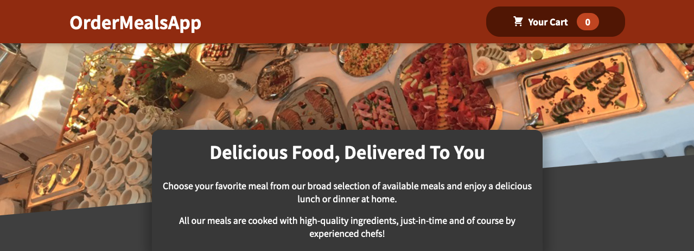

Welcome to the Order-Meal-Pan-Be Website

This website allows users to place orders for meals online. The website uses React and the Context API for managing state, and Firebase for storing and retrieving data.

You can view the website at https://order-meal-pan-be.netlify.app/.  
Features

    View a menu of available meals
    Add meals to a cart and place an order
    View past orders

Technologies Used

    HTML
    CSS
    JavaScript
    React
    Firebase
    Context API
    Netlify for hosting

Future Plans

    Add the ability to modify or cancel orders
    Allow users to create accounts and save their order history
    Expand menu and add more customization options for orders

Contact

If you have any questions or suggestions for the website, please don't hesitate to reach out. You can find contact information on the website.
